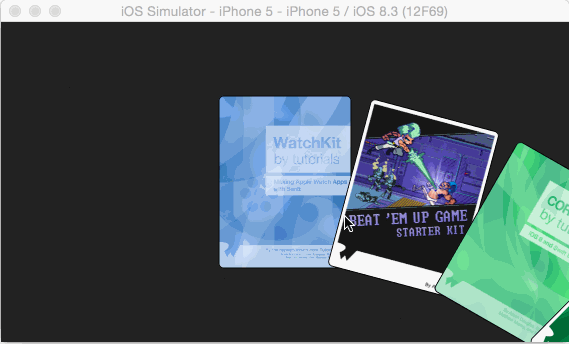
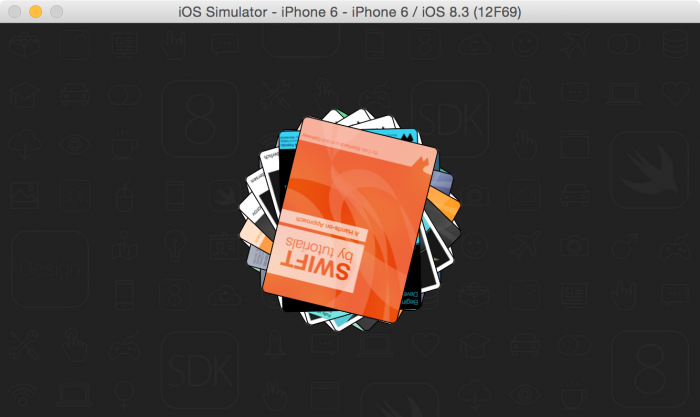

# CircularCollectionView
[raywenderlich教程](https://www.raywenderlich.com/107687/uicollectionview-custom-layout-tutorial-spinning-wheel)

## 一脸蒙蔽
每次只要是开始做自定义CollectionView的时候，都会被复杂的计算公式所迷惑，这次还是一样。😢总有些计算过程让我无头看起，然后demo却一笔带过，我只是想知道这些计算过程是如何思考出来的，不然自己怎么渔呢。
## 原理
本次demo是在横屏模式下，一个旋转的卡片视角模式。　　　　　　　　　　　　　　　　　

新建继承于UICollectionViewLayout的自定义类CircularCollectionViewLayout

设置cell的大小  

```
let itemSize = CGSize(width: 133, height: 173)
```

设置半径 

```
var radius: CGFloat = 500 {
	didSet {
		invalidateayout();
	}
}
```
### UICollectionViewLayoutAttributes
直接在CircularCollectionViewLayout中创建一个继承于UICollectionViewLayoutAttributes的类CircularCollectionViewLayoutAttributes

```
class CircularCollectionViewLayoutAttributes: UICollectionViewLayoutAttributes {
  
  var anchorPoint = CGPoint(x: 0.5, y: 0.5)
  var angle: CGFloat = 0 {
    didSet {
      zIndex = Int(angle * 1000000)
      transform = CGAffineTransformMakeRotation(angle)
    }
  }
  
  override func copyWithZone(zone: NSZone) -> AnyObject {
    let copiedAttributes = super.copyWithZone(zone) as! CircularCollectionViewLayoutAttributes
    copiedAttributes.anchorPoint = anchorPoint
    copiedAttributes.angle = angle
    return copiedAttributes
  }
}
```

在设置angle的时候直接设置zIndex，这个变量是决定哪个view显示在上层（当重叠的时候）

### 第一步：旋转
如何让每一张卡片进行不同角度的旋转
需要计算出每一张卡片的角度 

```
var anglePerItem: CGFloat { 
	return atan(itemSize.width / radius) 
}
``` 
这个角度可以是任何值，该值看上去使每个卡片不这么分散

OK,开始计算attributes,

-	计算cell的位置，centerX会根据contentOffset.x的变化而变化
-	设置cell的旋转角度	

```
class CircularCollectionViewLayout: UICollectionViewLayout {

  let itemSize = CGSize(width: 133, height: 173)
  var radius: CGFloat = 500 {
    didSet {
      invalidateLayout()
    }
  }
  
  var anglePerItem: CGFloat {
    return atan(itemSize.width / radius)
  }
  
  var attributesList = [CircularCollectionViewLayoutAttributes]()
  
  override class func layoutAttributesClass() -> AnyClass {
    return CircularCollectionViewLayoutAttributes.self
  }
  
  override func prepareLayout() {
    super.prepareLayout()
    
    let centerX = collectionView!.contentOffset.x + CGRectGetWidth(collectionView!.bounds) / 2.0
    
    attributesList = (0..<collectionView!.numberOfItemsInSection(0)).map { (i) -> CircularCollectionViewLayoutAttributes in
      let attributes = CircularCollectionViewLayoutAttributes(forCellWithIndexPath: NSIndexPath(forItem: i, inSection: 0))
      
      attributes.size   = itemSize
      attributes.center = CGPoint(x: centerX, y: CGRectGetMidY(collectionView!.bounds))
      attributes.angle  = anglePerItem * CGFloat(i)
      
      return attributes
    }
  }
}
```

### 移动

OK,按照剧本，卡片的旋转已经完成了。接下来就是移动了。移动就需要anchorPoint了。实际上transform在使用的时候就是根据anchorPoint的点做相应的改变的。[关于anchorPoint](http://kittenyang.com/anchorpoint/)
anchorPoint默认是(0.5, 0.5)，我们并不需要改变x的位置，我们需要改变的是y的位置，希望能将各个cell集中于一个点进行旋转。

因为transform实际上是根据anchorPoint为中心（position是anchorPoint的实际位置），所以接下来让我们忽略掉之前的旋转，各个图片都还是处于正常竖直的状态，我们需要的是将卡片扩散出去，向外部平移，实际上就是通过改变anchorPoint来改变frame

原始anchorPointY应该是 (itemSize.height / 2.0) / itemSize.height，即卡片的中点，现在需要加上半径，让卡片围绕其外部的点进行旋转。

```
let anchorPointY = (itemSize.height / 2.0 + radius) / itemSize.height
```
改变一下剧本

```
attributesList = (0..<collectionView!.numberOfItemsInSection(0)).map { (i) -> CircularCollectionViewLayoutAttributes in
      let attributes = CircularCollectionViewLayoutAttributes(forCellWithIndexPath: NSIndexPath(forItem: i, inSection: 0))
      
      attributes.size   = itemSize
      attributes.center = CGPoint(x: centerX, y: CGRectGetMidY(collectionView!.bounds))
      attributes.angle  = anglePerItem * CGFloat(i)
      attributes.anchorPoint = CGPoint(x: 0.5, y: anchorPointY)
      
      return attributes
```

别着急，做完这一步之后，卡片的中心点实际上就是整个view的中心点，但是我们并不想要这么实现，因为这样就看不到卡片了，全都在外围，所以需要将卡片的中心点往下平移，即改变所有卡片的中心点

```
class CircularCollectionViewCell: UICollectionViewCell {

  override func applyLayoutAttributes(layoutAttributes: UICollectionViewLayoutAttributes) {
    super.applyLayoutAttributes(layoutAttributes)
    
    if let circularAttributes = layoutAttributes as? CircularCollectionViewLayoutAttributes {
      
      layer.anchorPoint = circularAttributes.anchorPoint
      center.y += (circularAttributes.anchorPoint.y - 0.5) * CGRectGetHeight(bounds)
    }
  }
```

### 拖动旋转
✅,还差最后一步，样子都已经完成了，但是旋转的时候卡片并没有跟着中心点旋转，只是在x轴上平移。

当collectionView移动的时候，bounds是会发生改变的，所以我们使用下面的函数，来重新计算attributes

```
override func shouldInvalidateLayoutForBoundsChange(newBounds: CGRect) -> Bool {
    return true
  }
```

最后一张卡片在旋转完成的时候，角度=0，所以可以列出下面的一些公式

```
angle_for_last_item = angle_for_zero_item + (totalItems - 1) * anglePerItem
0 = angle_for_zero_item + (totalItems - 1) * anglePerItem
angle_for_zero_item = -(totalItems - 1) * anglePerItem

so
contentOffset.x = 0, angle = 0
contentOffset.x = maxContentOffset, angle = angleAtExtreme

so
angle = -angleAtExtreme * contentOffset.x / maxContentOffset
```

```
var angleAtExtreme: CGFloat {
    return collectionView!.numberOfItemsInSection(0) > 0 ? -CGFloat(collectionView!.numberOfItemsInSection(0) - 1) * anglePerItem : 0
  }
  
  var angle: CGFloat {
    return angleAtExtreme * collectionView!.contentOffset.x / (collectionViewContentSize().width - CGRectGetWidth(collectionView!.bounds))
  }
  
  // 加上一个angle
  attributes.angle       = anglePerItem * CGFloat(i) + angle
```

好了，看上去很简单是吧，实际上还是要靠自己的大脑去思考，前人种树。

### 选择显示卡片
按照上面的剧本，我们将卡片数量调整成100的时候，界面上是会有100张卡片的，不管能不能显示出来的，这造成了内存的大量浪费。

```
var startIndex = 0
    var endIndex   = collectionView!.numberOfItemsInSection(0) - 1
    
    if angle < -theta {
      startIndex = Int(floor((-theta - angle) / anglePerItem))
    }
    
    endIndex = min(endIndex, Int(ceil((theta - angle) / anglePerItem)))
    if startIndex > endIndex {
      startIndex = 0
      endIndex   = 0
    }
    
    attributesList = (startIndex...endIndex).map { (i) -> CircularCollectionViewLayoutAttributes in
      let attributes = CircularCollectionViewLayoutAttributes(forCellWithIndexPath: NSIndexPath(forItem: i, inSection: 0))
      
      attributes.size        = itemSize
      attributes.center      = CGPoint(x: centerX, y: CGRectGetMidY(collectionView!.bounds))
      attributes.angle       = anglePerItem * CGFloat(i) + angle
      attributes.anchorPoint = CGPoint(x: 0.5, y: anchorPointY)
      
      return attributes
    }
```

# END
各种计算问题，感觉烦躁，睡完觉来看过后，豁然开朗，静下来的时候思路才能顺通无阻
